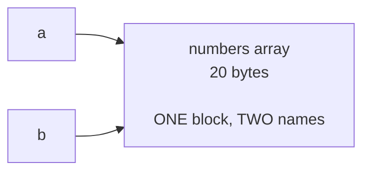
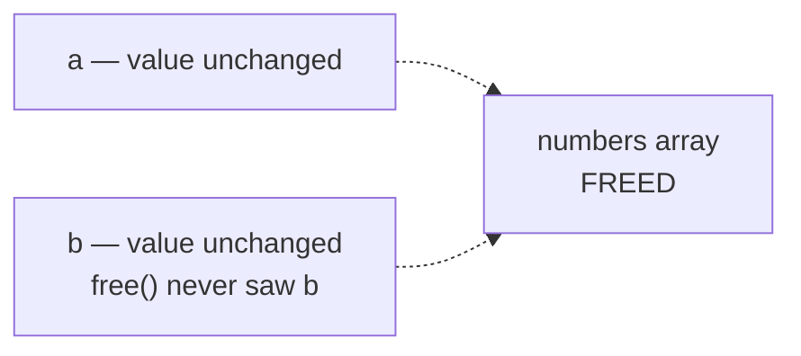

# Step-by-Step Memory Maps

Tracks memory state only: what exists, where it lives, what points at it, and when it dies. Generated by AI, manual inputs are ~~strikethroughs~~, //comments and the final section Claim verification

## Notation

```text
main()                          a frame
│
└── walk_stack(depth = 0)       a frame called by it
    ├── depth = 0               a local variable
    └── arr ──► numbers array   a pointer and its target

[FREED]                         block returned to the allocator
```

Indentation depth = call depth. The stack grows **downward** on the page.

**Storage classes:** *stack* dies with its frame · *heap* dies only at an explicit `free()` · *static* (string literals) lives for the whole process and is never freed.

---
---

# Part 1 — `stack_example.c`

No heap allocation occurs anywhere in this program.

---

## Step 1 — `walk_stack(0, 3)` entered

```text
STACK

main()
│
└── walk_stack(depth = 0)
    ├── depth     = 0
    ├── max_depth = 3
    └── marker    = 0


HEAP

empty
```

---

## Step 2 — `dump_frame("enter", 0)` entered

```text
STACK

main()
│
└── walk_stack(depth = 0)
    ├── marker = 0
    │
    └── dump_frame("enter", 0)          ◄── slot A
        ├── local_int = 100
        ├── local_buf[16]
        │   ├── [0]     = 'A'
        │   ├── [1]     = '\0'
        │   └── [2..15] = INDETERMINATE
        └── p_local ──► local_int
```

| Pointer | Target | Storage |
|---|---|---|
| `p_local` | `local_int`, same frame | stack |
| `label` | `"enter"` literal | **static** |

---

## Step 3 — `dump_frame` returns

```text
STACK

main()
│
└── walk_stack(depth = 0)
    ├── marker = 0
    │
    └── [slot A — UNRESERVED]
        old bytes still present
        no live object occupies them
```

**Ended:** `local_int`, `local_buf`, `p_local`
**Alive:** `marker`

---

## Step 4 — Recursion to depth 3

```text
STACK

main()
│
└── walk_stack(depth = 0)
    ├── marker = 0
    │
    └── walk_stack(depth = 1)
        ├── marker = 10
        │
        └── walk_stack(depth = 2)
            ├── marker = 20
            │
            └── walk_stack(depth = 3)
                └── marker = 30          ◄── base case
```

Four `marker` objects, all **Alive at once**, none aliasing each other. Every `dump_frame("enter", d)` was pushed and popped in between.

---

## Step 5 — `dump_frame("exit", 3)`

```text
STACK

    walk_stack(depth = 3)
    ├── marker = 30
    │
    └── dump_frame("exit", 3)           ◄── slot D
        ├── local_int = 103                 (the same slot the
        ├── local_buf[16]                    "enter" call used)
        └── p_local ──► local_int
```

A **new** frame in a released slot, freshly initialised. Same location, different object.

---

## Step 6 — Unwinding

```text
    walk_stack(3) ──┐
    walk_stack(2) ──┤
    walk_stack(1) ──┼──► destroyed LIFO, Last In First Out
    walk_stack(0) ──┤
    main()        ──┘

    At each depth, dump_frame("exit", d)
    reused the slot dump_frame("enter", d) had occupied.
```

---

## Timeline — `stack_example.c`

| Step | Live frames | Heap | Event |
|---|---|---|---|
| `main()` begins | 1 | empty | program entry |
| `walk_stack(0)` entered | 2 | empty | first recursion frame pushed |
| `dump_frame(enter, 0)` | 3 | empty | nested frame occupies slot A |
| `dump_frame` returns | 2 | empty | slot A unreserved — bytes untouched |
| Recursion to depth 3 | 5 | empty | four `walk_stack` frames alive together |
| `dump_frame(exit, 3)` | 6 | empty | **reuses the `enter` slot** — new object, same location |
| Unwind | 5 → 1 | empty | LIFO teardown, exit-side reuse at each depth |
| `main()` returns | 0 | empty | all automatic lifetimes ended |

**Peak: 6 frames. Heap allocations: zero.**

---
---

# Part 2 — `aliasing_example.c`

One heap block, two pointers, one `free()`.

---

## Step 1 — `main()` begins

```text
STACK                           HEAP

main()                          empty
├── a = NULL
├── b = NULL
└── n = 5
```

---

## Step 2 — `make_numbers(5)` allocates and fills

```text
STACK

main()
├── a = NULL
├── b = NULL
├── n = 5
│
└── make_numbers(n = 5)
    ├── n   = 5                 by-value copy of main's n
    ├── i   = 5                 loop exit value
    └── arr ──► numbers array


HEAP

numbers array — 20 bytes — ALIVE
        ┌─────┬─────┬─────┬─────┬─────┐
        │  0  │ 11  │ 22  │ 33  │ 44  │
        └─────┴─────┴─────┴─────┴─────┘
          [0]   [1]   [2]   [3]   [4]
```

---

## Step 3 — `make_numbers` returns

```text
STACK

main()
├── a ──► numbers array
├── b = NULL
└── n = 5

    make_numbers frame ENDED
    n, i, arr — lifetimes over


HEAP

numbers array — 20 bytes — ALIVE
```

The frame died; the block did not. Ownership moved from `arr` to `a`.

---

## Step 4 — `b = a`



```text
STACK

main()
├── a ──┐
├── b ──┼──► numbers array
└── n = 5


HEAP

numbers array — 20 bytes — ALIVE
        one block · one free() obligation · two names
```

C has no mechanism to track which pointer owns the block.

---

## Step 5 — `a[2]` and `b[2]` read

```text
HEAP

numbers array — ALIVE
        ┌─────┬─────┬─────┬─────┬─────┐
        │  0  │ 11  │ 22  │ 33  │ 44  │
        └─────┴─────┴──▲──┴─────┴─────┘
                       │
                  a[2] and b[2]
                  same address → both 22
```

---

## Step 6 — `free(a)`



```text
STACK                           HEAP

main()                          numbers array — [FREED]
├── a ──┐  DANGLING
├── b ──┼──► [FREED]
└── n = 5
```

`free()` takes an address, not a variable — it cannot find `b`, and changes neither pointer.

**Ended:** the block · **Alive:** `a` and `b` as variables

---

## Step 7 — Three accesses through the dangling pointer

```text
HEAP

numbers array — [FREED]
        ┌─────┬─────┬─────┬─────┬─────┐
        │  ?  │  ?  │  ?  │  ?  │  ?  │   contents indeterminate
        └─────┴─────┴──▲──┴──▲──┴─────┘
                       │     │
                    offset 8 │
                          offset 12
```

| Statement | Access | Offset | Result |
|---|---|---|---|
| `printf("%p", (void *)b)` | reads `b` itself | — | **safe** //safe according to valgrind, but the GCC standard classifies using an indeterminate value as undefined behaviour |
| `printf("%d", b[2])` | read, 4 bytes | 8 | **use-after-free** |
| `b[3] = 1234` | write, 4 bytes | 12 | **use-after-free** //worst of the three |
| `printf("%d", b[3])` | read, 4 bytes | 12 | **use-after-free** |

~~The write is the most dangerous: it modifies memory the allocator now controls.~~
//use-after-free write risks corrupting memory that is in use by other programs or by future mallocs. It is a vulnerability that has been used in many security exploits

---

## Step 8 — `main()` returns

```text
STACK                           HEAP

all frames destroyed            nothing outstanding
```

**No leak** — one allocation, one free. ~~Leak-free and severely incorrect are independent properties.~~

---

## Timeline — `aliasing_example.c`

| Step | `a` | `b` | Block | Event |
|---|---|---|---|---|
| `main()` begins | NULL | NULL | — | program entry |
| `malloc` in `make_numbers` | — | — | Alive, uninitialised | 20 B for 5 ints |
| Loop completes | — | — | Alive `{0,11,22,33,44}` | `arr[i] = i * 11` |
| Return to `main` | block | NULL | Alive | ownership moves from `arr` to `a` |
| `b = a` | block | **block (alias)** | Alive | pointer value copied ~~; block is not~~ |
| Read `a[2]`, `b[2]` | block | block | Alive | same address, both yield `22` |
| `free(a)` | **dangling** | **dangling** | **Ended** | one `free` invalidates every alias |
| Print `(void *)b` | dangling | dangling | Ended | safe — reads the variable only |
| Read `b[2]` | dangling | dangling | Ended | **invalid read**, offset 8 |
| Write `b[3]` | dangling | dangling | Ended | **invalid write**, offset 12 |
| Read `b[3]` | dangling | dangling | Ended | **invalid read**, offset 12 |
| `main()` returns | — | — | — | 1 alloc, 1 free — no leak |

---


# Claim verification

## `stack_example.c`
| # | Claim | Checked by |
|---|---|---|
| 1 | Consecutive `walk_stack` frames are a fixed distance apart | subtract the printed `&marker` values resulting in 48|
| 2 | `dump_frame(exit, d)` reuses the slot `dump_frame(enter, d)` used | comparing printed `&local_int` at each depth |
| 3 | A `dump_frame` frame sits below its `walk_stack` caller | subtract `&local_int` from `&marker` at the same depth |
| 4 | Peak live frames is 6 | Main() + Walk_stack 0,1,2,3 + dump_frame at maximum depth |
| 5 | Zero heap allocations occur | False - valgrind reports 1024 bytes allocated. Which is the result of the stdio librarys buffer. AI fails since there is no allocation in the code but there is in the process itself |

## `aliasing_example.c`

| # | Claim | Checked by |
|---|---|---|
| 6 | After `free(a)`, `b` keeps its original value | comparing `%p` output before and after |
| 7 | `b[2]` is at offset 8, `b[3]` at offset 12 | index × `sizeof(int)`; cross-check reported offsets |
| 8 | Reading `b[2]` after the free yields `22` | False and true, program reads garbage but valgrind quarantines freed blocks and so reads 22 |
| 9 | Three invalid accesses, no leak | count reported valgrind errors |
---